# ROS 2 Monitoring Application: Design Document

## 1. Introduction

This document provides a comprehensive Low-Level Design (LLD) for the ROS 2 Monitoring Application. It serves as the definitive technical reference for the application's architecture, components, interactions, and data flow. This LLD is intended for software developers, system architects, and quality assurance engineers involved in the development, maintenance, and testing of the application. The information herein is derived from a detailed analysis of the complete source code and the project's descriptive documentation.  

### 1.1 Purpose

The primary purpose of this document is to furnish a detailed technical blueprint of the ROS 2 Monitoring Application. It aims to deconstruct the software into its constituent components, clarifying the responsibilities, interactions, and design principles that govern its operation. By providing an exhaustive description of the static and dynamic architecture, this LLD facilitates a common understanding among technical stakeholders, streamlines future development and maintenance efforts, and establishes a baseline for verification and validation activities.

### 1.2 Scope

The application's scope is to deliver a comprehensive, real-time visualization and inspection tool for ROS 2 environments. It is engineered with a multi-backend UI architecture to support both graphical user interfaces (GUI) via Dear ImGui and terminal-based user interfaces (TUI) via Notcurses. The monitoring capabilities extend across the ROS 2 ecosystem, covering topics, nodes, and services, and also encompass system-level performance metrics such as CPU, memory, disk, and network utilization.  

A cornerstone of the application's scope is its advanced message inspection functionality. This feature leverages dynamic introspection to parse and visualize the structure and content of any ROS 2 message type at runtime, without prior knowledge of its definition at compile time. Furthermore, the application's utility is extended beyond live ROS 2 monitoring through the inclusion of a high-performance viewer for Diagnostic Log and Trace (DLT) files, making it a versatile tool for both online and offline analysis.  

### 1.3 Definitions, Acronyms, and Abbreviations

To ensure clarity and consistency, the following table defines key terms and acronyms used throughout this document. The project integrates technologies from diverse domains, including robotics, UI development, and system programming. This centralized glossary is essential for establishing a common vocabulary among all stakeholders.

| Term      | Definition                             | Context/Reference                                            |
| --------- | -------------------------------------- | ------------------------------------------------------------ |
| **DLT**   | Diagnostic Log and Trace               | A standardized format for logging and tracing in automotive systems. |
| **DPI**   | Dots Per Inch                          | A measure of spatial printing, video or image scanner dot density. |
| **ECU**   | Electronic Control Unit                | An embedded system in automotive electronics that controls one or more electrical systems. |
| **FPS**   | Frames Per Second                      | The frequency at which consecutive images (frames) are displayed. |
| **GLFW**  | Graphics Library Framework             | A multi-platform library for OpenGL, OpenGL ES and Vulkan development on the desktop. |
| **GUI**   | Graphical User Interface               | A type of user interface that allows users to interact with electronic devices through graphical icons. |
| **ImGui** | Dear ImGui                             | A bloat-free graphical user interface library for C++.       |
| **LLD**   | Low-Level Design                       | A detailed design phase of the software development lifecycle. |
| **RAII**  | Resource Acquisition Is Initialization | A C++ programming idiom for automatic resource management.   |
| **RAM**   | Random-Access Memory                   | A form of computer memory that can be read and changed in any order. |
| **RCL**   | ROS Client Library                     | The client library for a specific programming language, e.g., `rclcpp` for C++. |
| **RMW**   | ROS Middleware                         | The middleware layer in ROS 2 that provides the communication protocols. |
| **ROS**   | Robot Operating System                 | A set of software libraries and tools for building robot applications. |
| **TUI**   | Terminal User Interface                | A type of user interface that works within a text-based terminal environment. |
| **UI**    | User Interface                         | The means by which a user and a computer system interact.    |

### 1.4 Document Overview

This document is structured to provide a layered understanding of the application, beginning with a high-level overview and progressively delving into detailed component-level specifications. Section 2 details the application's key features. Section 3 describes the overall system architecture, design principles, and core component responsibilities. Section 4 provides a detailed breakdown of the static architecture, offering summaries for every major class and component. Section 5 explains the dynamic architecture, focusing on component interactions, data flow, event handling, and state management, etc.

## 2. Application Features

The ROS 2 Monitoring Application provides a rich set of features designed for comprehensive system analysis, as detailed in the project documentation and validated against the source code.  

- **Multi-Backend UI Architecture**: The application is built on a flexible architecture that supports multiple user interface backends. This is principally achieved through the `UIBackend` abstraction layer and the `UIBackendFactory`, which allows the desired backend to be selected at compile time. The two primary backends are:

  - **Dear ImGui**: A high-performance, dockable GUI ideal for desktop environments.

  - **Notcurses**: A rich terminal-based interface (TUI) suitable for headless or remote SSH sessions.  

- **Auto-Scaling UI**: The UI automatically adapts to different display resolutions. The ImGui backend leverages the `utils::DetectSystemScale` function to query the operating system's DPI settings, ensuring crisp rendering on high-DPI displays like 4K monitors. The Notcurses backend dynamically adjusts its layout to fit the current terminal size and capabilities.  

- **Advanced Message Inspection**: A core feature is the ability to inspect any ROS 2 message in real-time.

  - This is powered by a dynamic introspection engine comprising the `MessageParser` and `MessageIntrospector` classes, which can load ROS 2 type support libraries at runtime. This removes the need to compile the tool against every possible message type it might encounter.  

  - The `MessageInspectorPanel` provides a hierarchical view of nested message fields and includes a unique **Timeseries Visualization** tool to plot the value of numeric fields over time, complete with statistical analysis.  

- **Comprehensive Monitoring**: The application provides several dedicated panels for monitoring different aspects of a ROS 2 system.

  - **Topic Monitoring**: The `TopicsPanel` tracks real-time topic frequency, message counts, and provides live content previews.  

  - **Node Monitoring**: The `NodesPanel` displays active nodes, their namespaces, and their publisher/subscriber relationships.  

  - **Service Monitoring**: The `ServicesPanel` lists available services and monitors their availability and types.  

  - **System Metrics**: The `SystemMetricsPanel` presents historical graphs for CPU, memory, disk, and network usage, enabling performance trend analysis.  

- **DLT Log Viewer**: The application integrates a full-featured viewer for Diagnostic Log and Trace (DLT) files.

  - The `LogViewerPanel` is a highly optimized component designed to handle large log files efficiently. It includes its own DLT parser and provides advanced, multi-level filtering capabilities by ECU, Application ID, and Context ID, making it a powerful tool for offline log analysis.  

## 3. System Architecture

This section details the high-level architectural design of the application, including its layered structure, key design principles, and the responsibilities of its core components.

### 3.1 High-Level Architecture

The application is built upon a modular, layered architecture designed to promote flexibility, maintainability, and extensibility. The core design philosophy is the separation of the data acquisition and processing logic from the user interface presentation layer. This ensures that changes to the UI do not impact the underlying monitoring logic, and vice versa.

The architecture can be conceptually divided into three main logical tiers:

1. **Presentation Tier (UI)**: This tier is responsible for all user-facing rendering and input handling. It comprises the `UIBackend` interface, its concrete implementations (e.g., `ImGuiBackend`), the `UIComponents` orchestrator, and the individual `Panel` classes.
2. **Application Tier (Core Logic)**: Centered around the `ROSMonitor` class, this tier acts as the central coordinator. It manages the application's state, orchestrates the various monitoring subsystems, and serves as the single source of truth for the Presentation Tier.
3. **Data Tier (Monitoring & Utilities)**: This tier consists of the specialized `Monitor` classes (`TopicMonitor`, `NodeMonitor`, etc.) and `Utility` classes (`MessageParser`, `SystemMonitor`). It is responsible for the direct interaction with the ROS 2 graph and the operating system to gather and parse raw data.

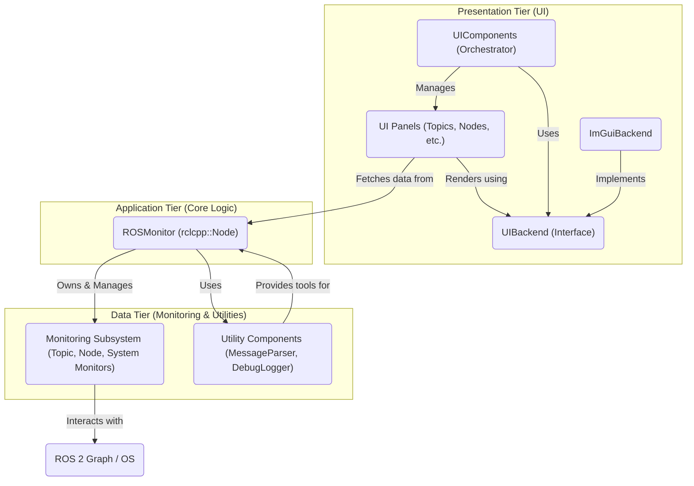

### 3.2 Architectural Layers

The application's structure is organized into several distinct layers, each with a well-defined responsibility.

- **Application Layer**: This is the outermost layer and the entry point of the program. The `main()` function in `main.cpp` instantiates `ROSMonitorApp`. `ROSMonitorApp` is a thin wrapper responsible for initializing the global ROS context (`rclcpp::init`) and managing the application's lifecycle, including signal handling for graceful shutdown.  

- **Core Logic Layer**: The `ROSMonitor` class constitutes the heart of the application. As an `rclcpp::Node`, it is the primary interface to the ROS 2 world. It owns and manages all monitoring data, orchestrates the background monitoring threads, and provides a unified, thread-safe data source for the UI layer.  

- **Monitoring Subsystem Layer**: This layer is composed of a collection of specialized classes, each owned by `ROSMonitor`. These include `TopicMonitor`, `NodeMonitor`, `ServiceMonitor`, `SystemMonitor`, and `MessageInspector`. Each class is an expert in its domain, responsible for gathering and processing a specific type of data.  

- **UI Abstraction Layer**: The `UIBackend` interface is a critical component that enables the application's multi-backend support. It defines a pure abstract contract for all UI rendering and input operations. The `UIBackendFactory` class uses the Factory design pattern to create the appropriate concrete backend instance (`ImGuiBackend` or `NotcursesBackend`) based on compile-time flags, completely decoupling the core application from any specific UI library.  

- **UI Presentation Layer**: This layer is managed by the `UIComponents` class, which orchestrates the lifecycle and rendering of all UI panels. The panels themselves (e.g., `TopicsPanel`, `NodesPanel`) inherit from the abstract `BasePanel` class and are responsible for fetching data from `ROSMonitor` and rendering it using the `UIBackend` interface.  

### 3.3 Key Design Principles

The architecture is guided by several fundamental software design principles that contribute to its robustness and maintainability.

- **Separation of Concerns**: The architecture strictly separates data acquisition logic (the `Monitor` subsystem) from data presentation logic (the `Panel` system). `ROSMonitor` acts as the intermediary. This clear division ensures that the code is organized, testable, and that changes in one area have minimal impact on others.

- **Abstraction**: The `UIBackend` interface is the most prominent example of abstraction in the system. It completely hides the complex implementation details of the underlying GUI or TUI library. The rest of the application interacts with the UI through a generic and stable API, making it possible to support different frontends like Dear ImGui and Notcurses with the same core logic.  

- **Modularity**: The system is composed of highly modular and cohesive components. The panel system, where each panel is a self-contained unit inheriting from `BasePanel`, is a clear example. Another is the `LogViewerPanel`, which demonstrates an "application within an application" pattern. This panel is a highly complex, self-contained component with its own dedicated parser (`DltParser`), state management for asynchronous file loading, and custom rendering logic. This design encapsulates the complexity of DLT parsing, isolating it from the ROS monitoring logic and making both parts of the system easier to develop and maintain independently.  

- **Factory Pattern**: The `UIBackendFactory` employs the Factory design pattern to decouple the client (`ROSMonitor`) from the instantiation of concrete UI backend objects. This centralizes the creation logic and makes the system easily extensible to support new UI backends in the future without modifying the core application code.  

### 3.4 Core Component Responsibilities

The application exhibits a clear and logical hierarchy of control, which is fundamental to its architecture. The `ROSMonitorApp` class initiates the process, `ROSMonitor` serves as the central brain and data hub, `UIComponents` manages the visual layout, and the specialized `Monitor` and `Panel` classes perform the detailed work. This top-down instantiation flow defines a clear chain of ownership and responsibility, preventing circular dependencies and making the system's structure predictable and robust.

| Component                             | Key Responsibility                                           | Source File(s)                        |
| ------------------------------------- | ------------------------------------------------------------ | ------------------------------------- |
| `ROSMonitorApp`                       | Application entry point, ROS initialization, signal handling. | `ros_monitor_app.hpp/.cpp`            |
| `ROSMonitor`                          | Central logic core, data management, ROS node interaction, monitoring orchestration. | `ros_monitor.hpp/.cpp`                |
| `UIBackend`                           | Abstract interface for all UI rendering and input operations. | `ui_backend.hpp`                      |
| `UIComponents`                        | Manages the lifecycle, layout, and rendering of all UI panels. | `ui_components.hpp/.cpp`              |
| `BasePanel`                           | Abstract base class providing common functionality for all UI panels. | `base_panel.hpp/.cpp`                 |
| `Topic/Node/Service/SystemMonitor`    | Specialized classes for gathering specific types of data.    | `ros_monitor.hpp`, `monitoring/*.cpp` |
| `MessageParser`/`MessageIntrospector` | Utilities for dynamic runtime parsing and analysis of ROS messages. | `utils/message_parser.hpp/.cpp`       |

### 3.5 Project File Structure

The project's file structure is organized to separate concerns between the core logic, UI, monitoring subsystems, and utilities. The `CMakeLists.txt` file at the root orchestrates the build process, conditionally compiling either the `ImGuiBackend` or `NotcursesBackend` based on build flags. The `include` directory contains all header files, organized into subdirectories for `ui` (with a further `panels` subdirectory), and `utils`. The `src` directory mirrors this structure, containing the corresponding `.cpp` implementation files. This clear separation facilitates maintainability and allows developers to easily locate components related to a specific functional area.  

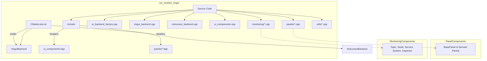

## 4. Static Architecture

This section provides a detailed examination of the application's static structure, focusing on the key classes and their responsibilities, member variables, and methods.

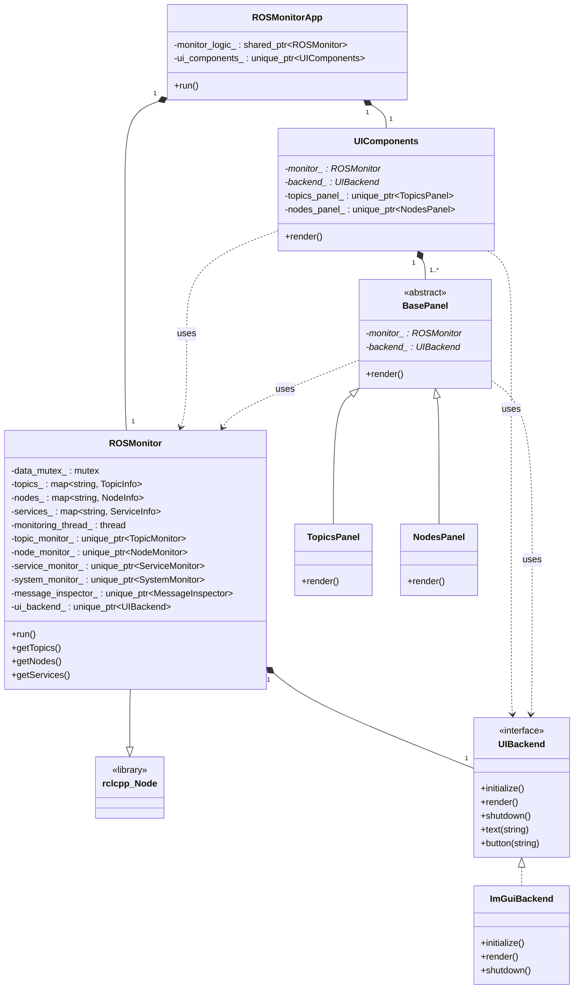

### 4.1 Core Application Components

#### 4.1.1 `ROSMonitorApp` Class

**Summary:** `ROSMonitorApp` is the main application class that encapsulates the entire ROS Monitor. It acts as the application's entry point and is responsible for initializing the ROS environment, creating the core logic (`ROSMonitor`) and UI (`UIComponents`) layers, and managing the application lifecycle.  

**Responsibilities:**

- Initializes the `rclcpp` library via `rclcpp::init()`.
- Sets up signal handlers for `SIGINT` and `SIGTERM` to ensure graceful shutdown.
- Instantiates the `ROSMonitor` class, which serves as the application's logic core.
- Instantiates the `UIComponents` class, which manages the entire UI presentation layer.
- Initiates the main application loop by calling `ROSMonitor::run()`.
- Ensures `rclcpp::shutdown()` is called in its destructor for proper ROS cleanup.

**Key Member Variables:**

- `monitor_logic_`: A `std::shared_ptr` to the `ROSMonitor` instance.
- `ui_components_`: A `std::unique_ptr` to the `UIComponents` instance.
- `instance_`: A static pointer to the `ROSMonitorApp` object, used by the static signal handler to access the application instance.

#### 4.1.2 `ROSMonitor` Class (ROS Node)

**Summary:** `ROSMonitor` is the central logic core of the application, implemented as an `rclcpp::Node`. It orchestrates all monitoring activities, manages the application's data state, and serves as the single source of truth for the UI. It effectively bridges the gap between the low-level monitoring subsystems and the high-level UI presentation layer.  

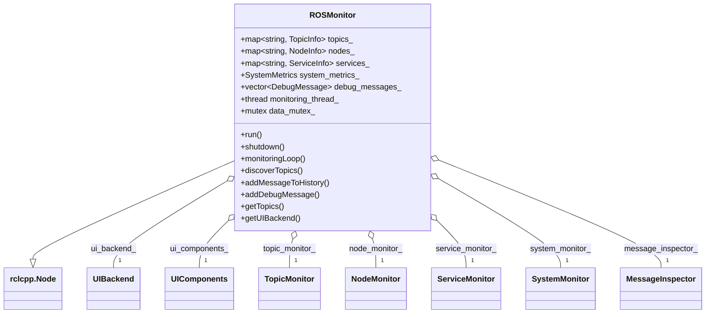

**Responsibilities:**

- Acts as a ROS 2 node named "ros_monitor" for discovering topics, nodes, and services.
- Owns and manages instances of all monitoring subsystems: `TopicMonitor`, `NodeMonitor`, `ServiceMonitor`, `SystemMonitor`, and `MessageInspector`.
- Maintains the central data stores for topics (`topics_`), nodes (`nodes_`), services (`services_`), system metrics (`system_metrics_`), and debug logs (`debug_messages_`).
- Runs a dedicated `monitoring_thread_` to periodically update all monitored data in the background, preventing the UI from blocking.
- Initializes the `UIBackend` via the `UIBackendFactory`.
- Provides public getter methods for the UI to access the monitored data in a thread-safe manner, using `std::mutex` to protect shared data.
- Handles application control logic, such as enabling/disabling monitoring and processing exit requests.


### 4.2 UI Subsystem

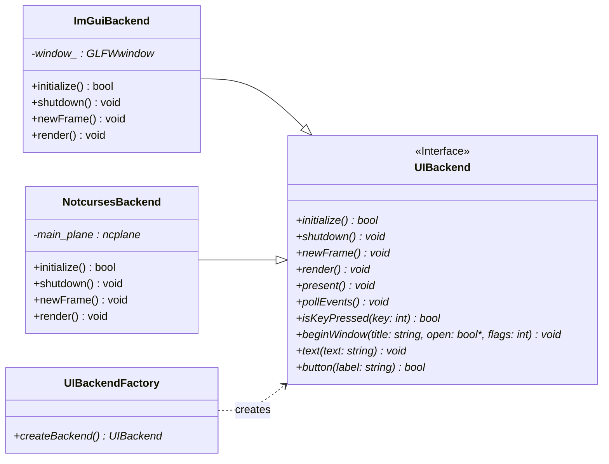

#### 4.2.1 `UIBackend` Interface

**Summary:** `UIBackend` is a pure abstract class that defines a stable, platform-agnostic API for all UI operations. It decouples the application's UI logic from any specific rendering framework (like Dear ImGui). It defines a comprehensive set of virtual functions for window management, event handling, widget rendering (windows, buttons, text, tables, plots), and styling.  

**Responsibilities:**

- To define a stable contract for all UI-related tasks, ensuring that different backends can be used interchangeably.
- To abstract away the implementation details of initializing, rendering, and shutting down a UI framework.
- To provide a common interface for rendering widgets and handling keyboard and mouse input.

#### 4.2.2 `UIBackendFactory`

**Summary:** A simple factory class with a single static method, `createBackend()`. Its purpose is to instantiate the correct concrete `UIBackend` implementation based on compile-time flags (`USE_IMGUI_BACKEND` or `USE_NOTCURSES_BACKEND`). This pattern centralizes the creation logic and avoids direct dependencies on concrete backend classes in the core application.  

**Responsibilities:**

- To create and return a `std::unique_ptr<UIBackend>` pointing to a concrete backend instance.
- To throw a `std::runtime_error` if no backend is selected during compilation, ensuring a build-time configuration error is caught at runtime.

#### 4.2.3 `ImGuiBackend` Implementation

**Summary:** The concrete implementation of the `UIBackend` interface for the Dear ImGui framework. It handles the low-level details of initializing GLFW and OpenGL, setting up the ImGui and ImPlot contexts, managing the main render loop, and translating the abstract `UIBackend` calls into specific ImGui function calls.  

**Responsibilities:**

- To implement all pure virtual functions defined in the `UIBackend` interface.
- To manage the GLFW window lifecycle, including creation and destruction.
- To handle the ImGui rendering pipeline (`newFrame`, `render`, `present`).
- To map abstract key and modifier constants (e.g., `UIBackend::KEY_Q`) to ImGui's internal key codes (e.g., `ImGuiKey_Q`).
- To wrap ImGui and ImPlot widget calls (e.g., `ImGui::Button`, `ImPlot::PlotLine`) to fulfill the `UIBackend` contract.

#### 4.2.4 `UIComponents` Class

**Summary:** The primary UI orchestrator for the application. It manages the lifecycle and rendering of all the individual UI panels. It also handles global UI features such as the main menu bar, keyboard shortcuts for toggling panels, and the persistence of layout configurations to a file.  

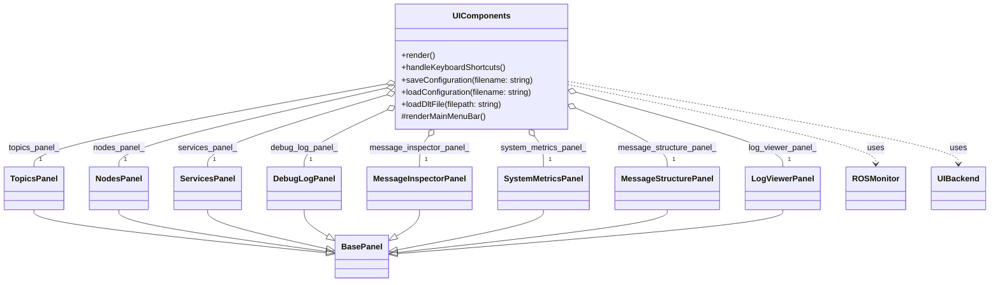

**Responsibilities:**

- To create and own `std::unique_ptr` instances of all panel classes (`TopicsPanel`, `NodesPanel`, etc.).
- To render the main application window, menu bar, and a tab bar for organizing the main views.
- To render the individual panels within a dockable space based on their visibility flags (e.g., `show_topics_panel_`).
- To process global keyboard shortcuts for controlling panel visibility and other application-level actions.
- To manage saving and loading the UI layout and window states to/from an `.ini` file.

### 4.3 Panel System

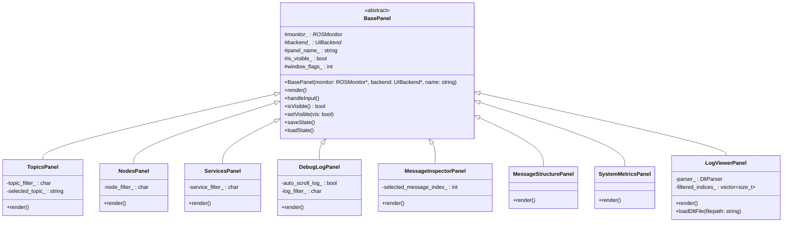

#### 4.3.1 `BasePanel` Abstract Class

**Summary:** The abstract base class from which all other UI panels inherit. It provides a common interface and shared functionality, such as visibility management, state persistence hooks, and helper methods for rendering common UI elements. This promotes code reuse and a consistent structure across all panels.  

**Responsibilities:**

- Defining the `virtual void render() = 0` method, which forces all concrete panels to implement their own rendering logic.
- Providing common member variables for all panels, including pointers to `ROSMonitor` and `UIBackend`, the panel's name, and its visibility state.
- Offering helper methods for rendering text (`renderCopyableText`), plotting graphs (`plotFrequencyGraph`), and handling asynchronous file saving.

#### 4.3.2 Panel Overview

The application's UI is constructed from a set of modular panels, each responsible for a specific view. The existence of the `BasePanel` class and comments in the source code, such as `// Helper methods for rendering text with copy functionality (matching // original UIComponents)`, indicate a deliberate refactoring from a monolithic `UIComponents` class to this more scalable panel system. This design improves maintainability by encapsulating the logic for each view within its own class, following object-oriented principles.

| Panel Class             | Purpose                                       | Key Features                                                 |
| ----------------------- | --------------------------------------------- | ------------------------------------------------------------ |
| `TopicsPanel`           | Displays and manages ROS 2 topics.            | Filterable list, real-time stats (frequency, count), topic selection. |
| `NodesPanel`            | Displays and manages ROS 2 nodes.             | Filterable list, shows namespaces and relationships (pubs/subs/services). |
| `ServicesPanel`         | Displays and manages ROS 2 services.          | Filterable list, shows service type and availability status. |
| `SystemMetricsPanel`    | Displays system performance metrics.          | Real-time graphs for CPU, memory, disk, and network usage.   |
| `MessageInspectorPanel` | Provides deep inspection of ROS messages.     | Hierarchical field view, timeseries plotting of numeric fields, statistics. |
| `MessageStructurePanel` | Analyzes and displays ROS message structures. | Tree view of message schema (field names and types), structure export. |
| `DebugLogPanel`         | Displays internal application log messages.   | Text filtering, auto-scrolling, log export to file.          |
| `LogViewerPanel`        | Views and analyzes DLT log files.             | High-performance parsing, advanced filtering (ECU, App, Context). |

#### 4.3.3 `TopicsPanel`

**Summary:** Displays a filterable, real-time list of all discovered ROS 2 topics. It shows key information like message type, frequency, and message count. Clicking a topic name selects it for detailed inspection in the `MessageInspectorPanel` and `MessageStructurePanel`.  

#### 4.3.4 `NodesPanel`

**Summary:** Displays a filterable list of all active ROS 2 nodes. It provides details on the node's namespace and its relationships within the ROS graph, including its publications, subscriptions, and offered services.  

#### 4.3.5 `ServicesPanel`

**Summary:** Displays a filterable list of all available ROS 2 services, showing their type and current availability status. This allows users to quickly see which services are active in the system.  

#### 4.3.6 `SystemMetricsPanel`

**Summary:** Renders real-time system performance data provided by the `SystemMonitor`. This includes current usage percentages for CPU, memory, and disk, along with historical graphs for trend analysis.  

#### 4.3.7 `MessageInspectorPanel`

**Summary:** A powerful tool for the deep inspection of messages from a selected topic. It provides a detailed, hierarchical view of message fields and their live values. Its standout feature is a timeseries visualization tool that allows users to plot the value of any numeric field over time, complete with statistical analysis.  

#### 4.3.8 `MessageStructurePanel`

**Summary:** Displays the hierarchical structure (field names and their types) of a message from a selected topic, but without showing the live values. This panel is useful for understanding the schema or definition of a message type, separate from its content.  

#### 4.3.9 `DebugLogPanel`

**Summary:** Displays internal log messages generated by the application itself, categorized by severity (DEBUG, INFO, WARN, ERROR). It includes features for filtering by text content, auto-scrolling to the latest message, and saving the logs to a file for offline analysis.  

#### 4.3.10 `LogViewerPanel`

**Summary:** A highly advanced, self-contained component for loading, parsing, and analyzing DLT files. It is performance-optimized to handle very large files and offers sophisticated filtering by ECU, Application ID, and Context ID. It functions as a complete log analysis tool embedded within the application.  

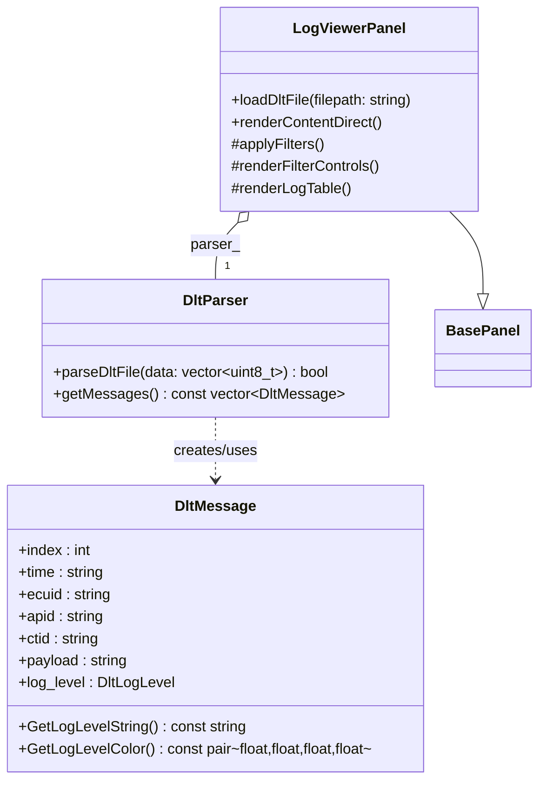


### 4.4 Monitoring Subsystem

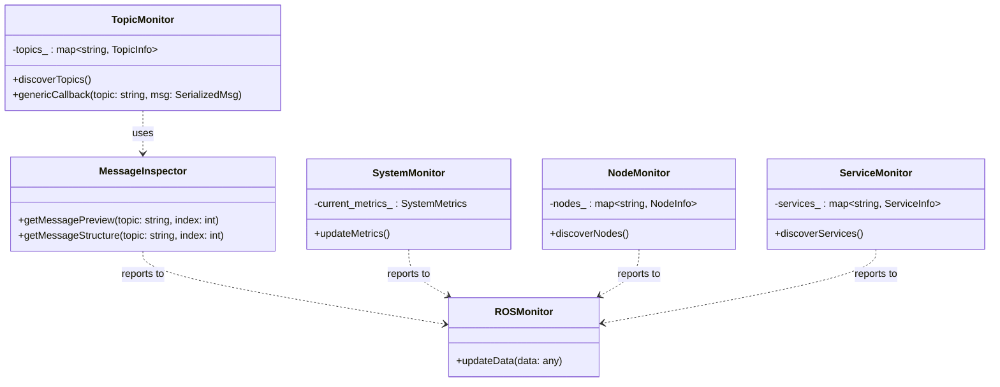

#### 4.4.1 `TopicMonitor`

**Summary:** This class is responsible for discovering ROS 2 topics, managing generic subscriptions to them, and calculating real-time statistics like message frequency. It uses a callback mechanism to notify `ROSMonitor` of newly received messages, which are then passed to the `MessageInspector` for detailed analysis.  

#### 4.4.2 `NodeMonitor`

**Summary:** This class is responsible for discovering active ROS 2 nodes and enriching their information. After discovering a node, it queries the ROS graph to identify the topics the node publishes and subscribes to, as well as the services it provides.  

#### 4.4.3 `ServiceMonitor`

**Summary:** This class is responsible for discovering available ROS 2 services and tracking their type and availability status over time. It periodically checks the ROS graph to see if services are still being advertised.  

#### 4.4.4 `SystemMonitor`

**Summary:** This class is responsible for collecting system-level performance metrics. On Linux systems, it achieves this by reading from the `/proc` filesystem to gather data on CPU utilization, memory usage, disk space, and network I/O rates.  

#### 4.4.5 `MessageInspector`

**Summary:** This class serves as the engine for message analysis. It uses `MessageParser` to obtain a structured representation of a message, stores a history of recent messages for each topic in a deque, and calculates statistics. It is the core component that enables the advanced inspection features of the UI.  

### 4.5 Utility Components

#### 4.5.1 `MessageParser` & `MessageIntrospector`

**Summary:** This pair of static utility classes forms the application's powerful dynamic message analysis engine. `MessageParser` handles the deserialization and value extraction of messages by dynamically loading ROS 2 type support libraries (`.so` files) at runtime. `MessageIntrospector` provides metadata about message types, such as their field names and overall structure.  

The design choice to dynamically load type support libraries using `dlopen` is a significant architectural decision. It provides the tool with incredible flexibility, allowing it to inspect any message type on a system without needing to be pre-compiled against it. This elevates the application from a simple monitor for known messages to a general-purpose diagnostic tool. However, this approach introduces the complexity of managing shared library paths and the potential for runtime errors if a type support library cannot be found. The inclusion of caching mechanisms (`type_support_cache_`, `library_cache_`) demonstrates an awareness of and mitigation for the performance implications of this dynamic approach.

#### 4.5.2 Logging Architecture & Flow

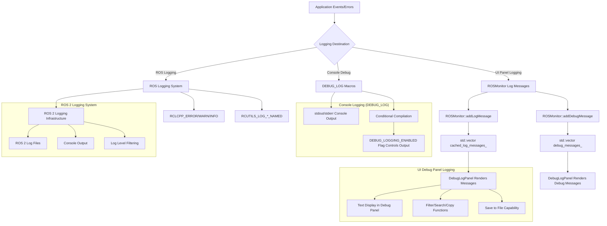

**`DebugLogger` (Macros)**

**Summary:** A utility for internal application logging and performance timing. It provides a set of macros (`DEBUG_LOG`, `DEBUG_LOG_ERROR`, etc.) that can be compiled out in release builds by setting `DEBUG_LOGGING_ENABLED` to 0, thus eliminating performance overhead. 

#### 4.5.3 System Scale Utilities

**Summary:** This component contains the `utils::DetectSystemScale` function, which is responsible for determining the system's display scaling factor to support high-DPI displays. It uses a multi-pronged approach, querying GLFW, common environment variables (`GDK_SCALE`, `QT_SCALE_FACTOR`), and Linux-specific tools (`gsettings`, `xrdb`) to find the most accurate scaling value.  

## 5. Dynamic Architecture

This section describes how the static components interact at runtime. It covers the application's startup sequence, the flow of data through the system, how user events are handled, and the mechanism for managing application state.

### 5.1 Component Interactions & Sequences

#### 5.1.1 Application Startup Sequence

The application's startup sequence follows a clear, top-down flow of control, ensuring that dependencies are created before they are needed.

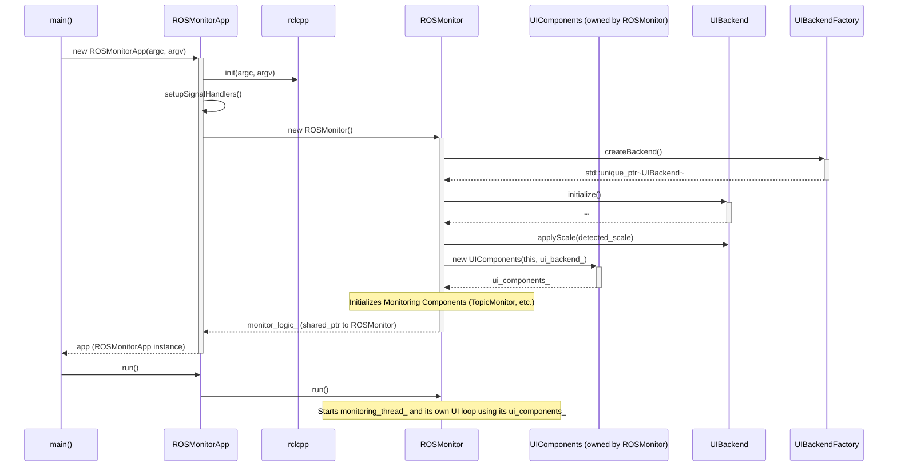

**Application Startup Trace:**

1. Execution begins in `main()`, which instantiates the `ROSMonitorApp` class.  

2. The `ROSMonitorApp` constructor is invoked. It first initializes the ROS 2 client library by calling `rclcpp::init()`. It then sets up signal handlers for graceful termination.

3. `ROSMonitorApp` proceeds to create the core logic layer by instantiating `ROSMonitor` as a shared pointer (`monitor_logic_`).

4. The `ROSMonitor` constructor executes. It creates the `UIBackend` via the `UIBackendFactory`, which abstracts the specific UI framework. It then creates instances of all the monitoring subsystems (`TopicMonitor`, `NodeMonitor`, etc.).

5. Crucially, inside its own constructor, `ROSMonitor` creates the `UIComponents` object, passing it pointers to itself (`this`) and the newly created `UIBackend`.

6. The `UIComponents` constructor then creates instances of all the individual `Panel` classes (e.g., `TopicsPanel`, `NodesPanel`), passing them the pointers to `ROSMonitor` and `UIBackend`.

7. Once the `ROSMonitorApp` object is fully constructed, `main()` calls `app.run()`.

8. `ROSMonitorApp::run()` delegates the call to `monitor_logic_->run()`.

9. `ROSMonitor::run()` starts the background `monitoring_thread_` and then enters the main UI loop, which continuously polls for events, renders the UI, and processes ROS 2 callbacks until an exit is requested.  

#### 5.1.2 UI Panel Rendering & Communication:

This diagram outlines the general flow when rendering a UI panel.

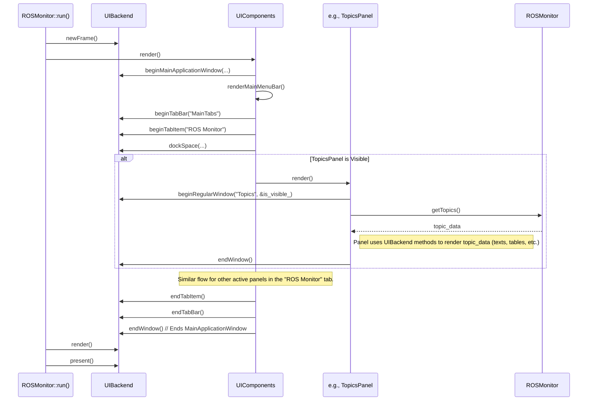

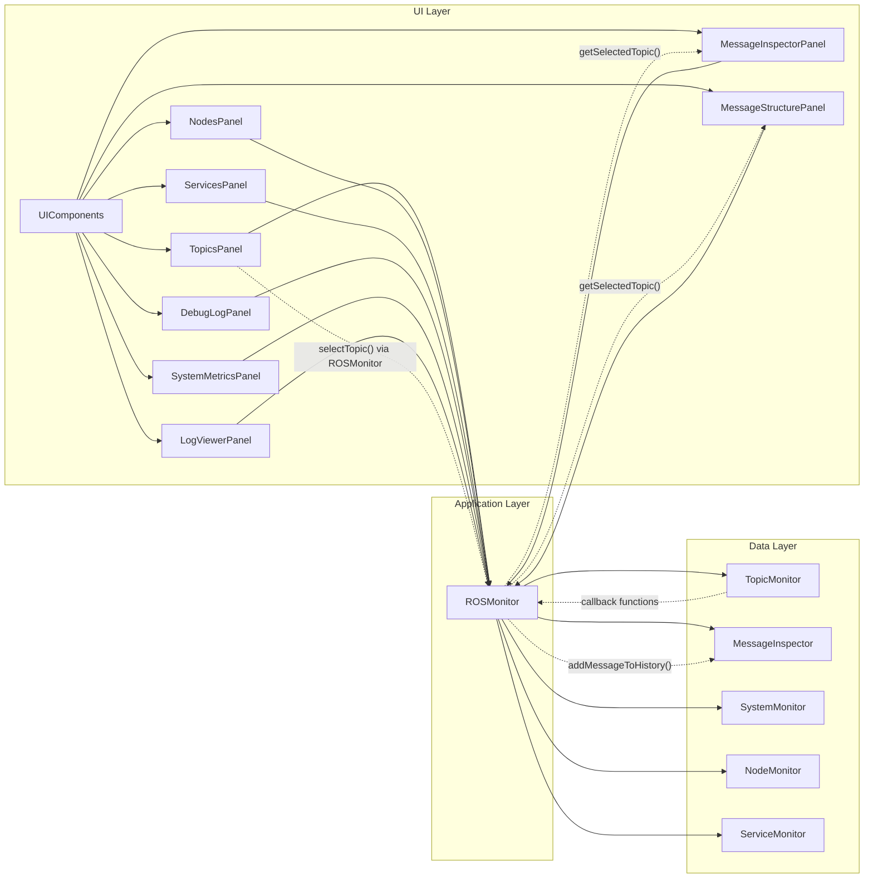

#### 5.1.3 ROS Message Data Flow Trace:

The flow of a ROS message from its reception on the network to its display in the UI demonstrates the effective separation of concerns between the monitoring and presentation layers.

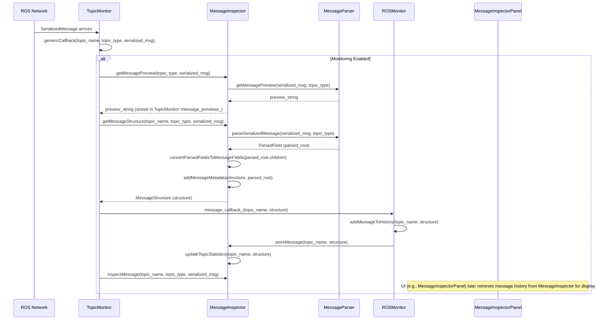

1. **Reception**: A ROS message arrives and is captured by a `rclcpp::GenericSubscription`, which triggers the `TopicMonitor::genericCallback` method.

2. **Initial Processing**: `TopicMonitor` immediately updates its internal statistics (message count, frequency intervals). It then calls `MessageInspector` to generate a quick preview string and a detailed `MessageStructure`.

3. **Parsing**: The `MessageInspector` uses `MessageParser` to deserialize the raw message bytes and parse them into a structured `MessageStructure` object, which contains a hierarchy of `MessageFieldInfo` objects.

4. **Notification & Storage**: `TopicMonitor` invokes a callback into `ROSMonitor`. This callback, `ROSMonitor::addMessageToHistory`, then instructs the `MessageInspector` to store the newly parsed `MessageStructure` in its historical data store (`message_history_`), a deque that holds the last 100 messages for that topic.

5. **UI Rendering (Topics Panel)**: In the main UI loop, the `TopicsPanel` calls `monitor_->getTopics()` to retrieve the latest topic data. This data includes the updated message count and the preview string generated in step 2, which are then displayed in the topics list.

6. **UI Rendering (Inspector Panel)**: If a user has selected a topic in the `TopicsPanel`, the `MessageInspectorPanel` becomes active for that topic. It calls `monitor_->getAllMessagesForTopic()` to retrieve the full history of parsed `MessageStructure` objects from the `MessageInspector`. It then renders this detailed, hierarchical data, allowing the user to explore the fields and values of each message in the history.  

#### 5.1.4 DLT File Loading and Parsing Sequence (Synchronous Path):

This diagram illustrates the synchronous loading and parsing of a DLT file.

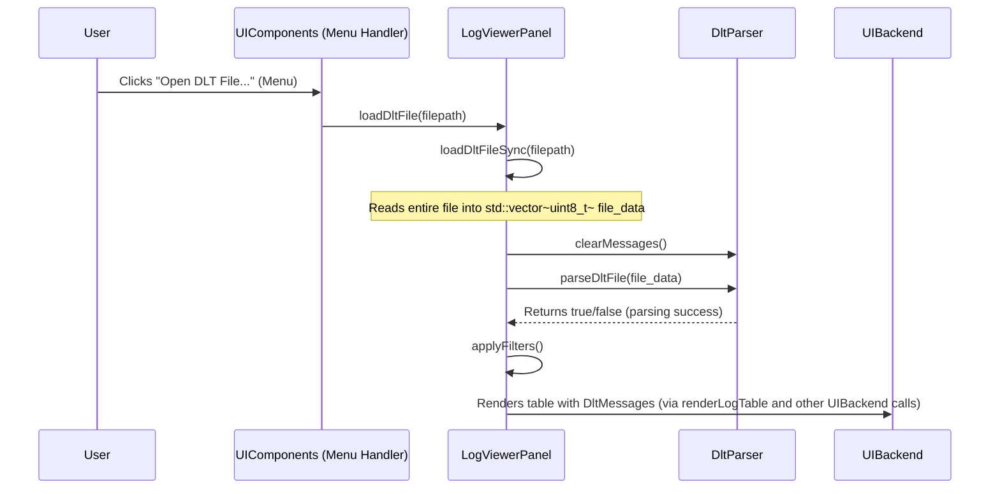

#### 5.1.5 Logging Data Flow

The application uses two distinct logging mechanisms for different purposes.

**1. Console Debug Logging (`DEBUG_LOG` Macros)** This mechanism is intended for low-level developer debugging during development.

- **Source**: Calls to macros like `DEBUG_LOG("message")` or `DEBUG_SCOPED_TIMER("label")` in the C++ code.
- **Control**: It is controlled at compile time by the `DEBUG_LOGGING_ENABLED` preprocessor definition in `debug_logger.hpp`. If this is `0`, the macros compile to empty statements, incurring zero runtime cost.
- **Destination**: When enabled, log messages are written directly to the standard output/error streams (`std::cout`, `std::cerr`). They appear in the console where the application was launched.
- **Use Case**: Debugging the application's internal logic, performance timing, and verifying code paths without cluttering the user-facing UI.

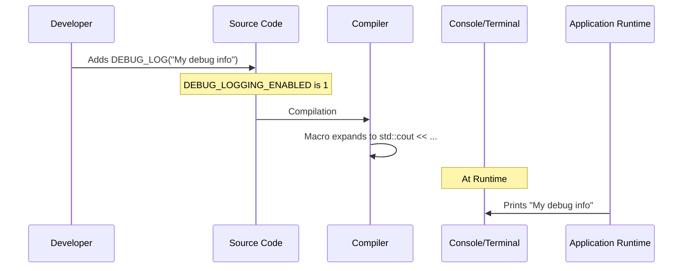

**2. UI-Visible Application Logging (`DebugLogPanel`)** This mechanism is for providing high-level status, warning, and error messages to the end-user.

- **Source**: Calls to `ROSMonitor::addDebugMessage(LogLevel, "message")` from various components (e.g., `MessageParser`, `LogViewerPanel`).
- **Control**: This logging is always active at runtime.
- **Flow**:
  1. A component calls `ROSMonitor::addDebugMessage()`.
  2. `ROSMonitor` creates a `DebugMessage` struct (containing the log level, message, and a timestamp) and stores it in its thread-safe `debug_messages_` vector.
  3. During the UI render loop, the `DebugLogPanel` calls `ROSMonitor::getLogMessages()` to retrieve the list of formatted log strings.
  4. The panel renders these strings, applying filters and color-coding based on the log level.
- **Destination**: The "Debug Log" panel within the application's graphical user interface.
- **Use Case**: Informing the user about important events, such as failed file loads, unsupported message types, successful operations, or warnings.

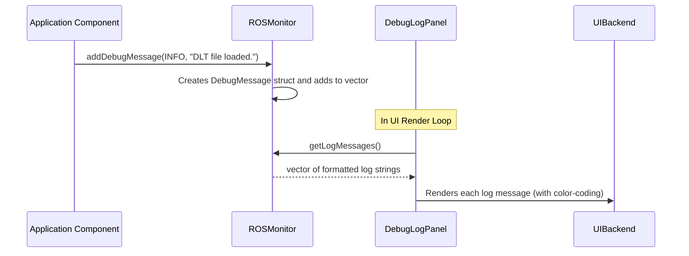

### 5.2 Data Flow

#### 5.2.1 Message Processing Pipeline

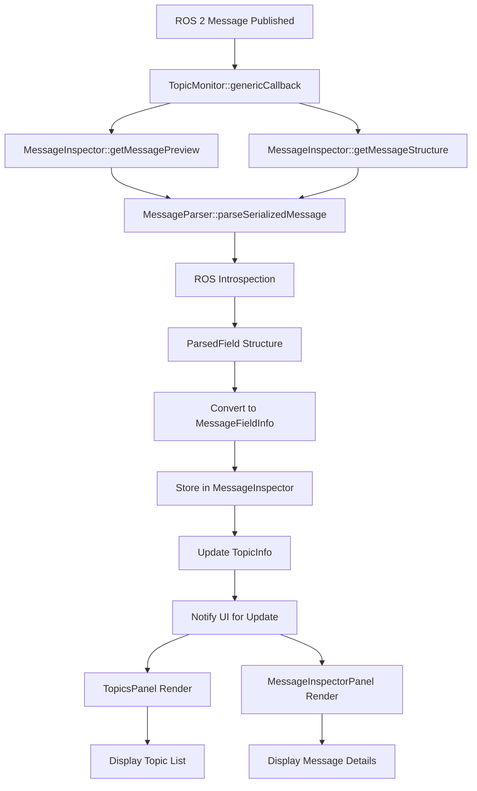

#### 5.2.2 Threading and Concurrency Architecture

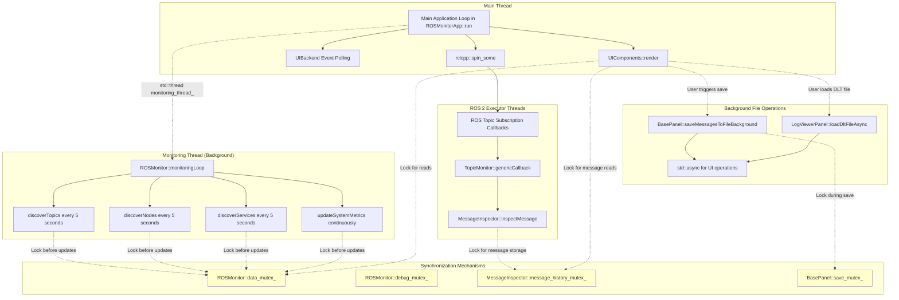

#### 5.2.3 UI Rendering Pipeline

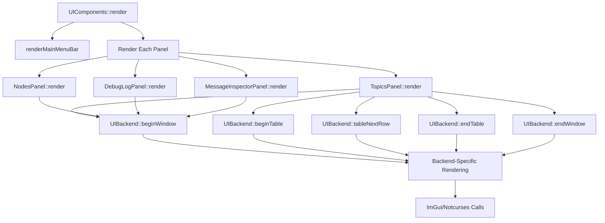

### 5.3 Configuration and State Management

The application provides a mechanism to persist its UI state across sessions, ensuring a consistent user experience. This is managed by the `UIComponents` class and uses a simple `.ini` file format.

**Configuration Saving and Loading:**

- **Saving**: State is saved either automatically on exit (if `auto_save_layout_` is true) or manually via a menu option. The `UIComponents::saveConfiguration()` method is responsible for this process. It gathers the current state, including the visibility of each panel, the geometry of the main window (obtained from the `UIBackend`), and other settings, and writes them to `ros_monitor_layout.ini`.
- **Loading**: On application startup, the `UIComponents` constructor calls `loadConfiguration()`. This method reads the `ros_monitor_layout.ini` file, parses the key-value pairs under different sections (e.g., `[Windows]`, ``), and applies the loaded values to its internal state variables. This restores the user's previous layout and panel visibility settings.
- **`.ini` File Format**: The configuration is stored in a human-readable `.ini` file. This file contains sections like `[Windows]` for panel visibility. Boolean values are stored as "1" or "0".  

```mermaid
flowchart TD
    A[Application Start] --> B[Load Configuration]
    B --> C{Config File Exists?}
    
    C -->|Yes| D[Parse Config File]
    C -->|No| E[Use Default Settings]
    
    D --> F[Apply Window States]
    D --> G[Apply Panel Visibility]
    D --> H[Apply User Preferences]
    
    E --> F
    E --> G
    E --> H
    
    F --> I[Set Main Window Position/Size]
    G --> J[Show/Hide Panels]
    H --> K[Set Auto-save, Filters, etc.]
    
    I --> L[Application Running]
    J --> L
    K --> L
    
    L --> M[User Actions]
    M --> N[Panel Visibility Changes]
    M --> O[Window Resize/Move]
    M --> P[Filter Text Changes]
    M --> Q[Topic Selection]
    
    N --> R[Update Panel State in Memory]
    O --> S[Update Window State in Memory]
    P --> T[Update Filter Buffer in Memory]
    Q --> U[Update Selection State in Memory]
    
    R --> V[Continue Application]
    S --> V
    T --> V
    U --> V
    
    V --> W[Regular Render Cycle]
    W --> X["checkAndAutoSave() Called Every Frame"]
    
    X --> Y{Auto-save Enabled AND 5 Minutes Elapsed?}
    Y -->|Yes| Z[Save Configuration to File]
    Y -->|No| AA[Continue Application]
    
    Z --> AB[Write Config File]
    AB --> AC[Update Last Save Time]
    AC --> AA
    
    AA --> AD{Exit Requested?}
    AD -->|No| M
    AD -->|Yes| AE[Save Final Configuration]
    AE --> AF[Cleanup and Exit]
```

### 5.4 Timeseries Visualization Window State

```mermaid
stateDiagram-v2
    [*] --> Closed
    Closed --> Open : openTimeseriesWindow(field_path)
    Open --> Open : updateTimeseriesData() / renderPlot()
    Open --> Closed : User closes window / Topic changes
    Open : Displays plot of field values
    Open : Collects statistics (e.g., parsing_failures)
```

### 5.5 Event Handling

User input, particularly keyboard shortcuts, is handled through a clean, abstracted process that ensures the UI logic is independent of the specific input system of the backend framework.

**Keyboard Shortcut Handling Process:**

1. **Event Polling**: In each iteration of the main UI loop, `ROSMonitor::run()` calls `ui_backend_->pollEvents()`. The concrete backend (e.g., `ImGuiBackend`) gathers all pending input events from the underlying windowing system (e.g., GLFW).
2. **Shortcut Processing**: The `UIComponents::render()` method calls `UIComponents::handleKeyboardShortcuts()`.
3. **Abstracted Input Query**: `handleKeyboardShortcuts()` queries the input state using the `UIBackend` interface. For example, to detect `Ctrl+1`, it calls `backend_->isModifierPressed(UIBackend::MODIFIER_CTRL)` and `backend_->isKeyPressed(UIBackend::KEY_1)`.
4. **State Modification**: If a valid shortcut combination is detected, `UIComponents` modifies its internal state. For instance, upon detecting `Ctrl+1`, it toggles the boolean value of `show_topics_panel_`.
5. **UI Update**: On the subsequent call to `UIComponents::render()`, the change in the `show_topics_panel_` flag is detected, and the `TopicsPanel` is either rendered or skipped, making the change visible to the user.

This flow cleanly separates the platform-specific detection of raw input (handled by the `UIBackend`) from the application-specific interpretation of that input into actions (handled by `UIComponents`).  
